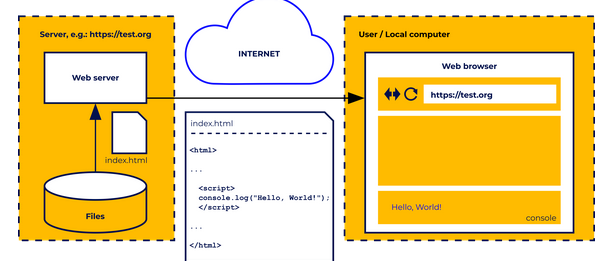
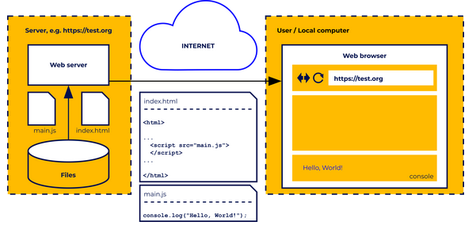
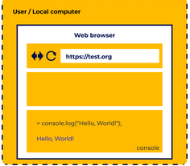

### Day 3 - The "Hello, World!" Program
The idea is to write out something on the screen using a specific language. 
1. First, it allows us to see the basic syntax of the language and compare it to other programming languages. 
2. Second, it’s a very simple program, and anyone can easily write it or copy it from the internet and check if their tools and environment are set up correctly. 
3. Third, it’s a program that outputs something, so it provides feedback on whether it was executed correctly or not.

In the case of client-side JavaScript, displaying something on the screen can be understood in two ways.

1. First, client-side JavaScript is always executed in the context of a website and allows you to manipulate elements of that website. So we can, for example, use the appropriate function to insert some text, change a title, create a table, etc. on the page. This way, we control the visual part of the website.

2. Second, we can use the console as a screen to write some information. The console, as we mentioned in the previous chapter, is part of the developer tools. So it is not visible by default, and it must be properly enabled (we also wrote about this in the previous chapter). For our needs, it will be much more convenient to use the console, as we will avoid the need for a thorough analysis of the structure of the website.

```javascript

console,log("Hello World!");

```
> We can treat the console.log as a function*. In fact, the function is only a log, and console is the object to which the function belongs.
>
> *This type of function, belonging to an object, is generally called a method. But once again, for the time being, to simplify certain things, let’s assume that this is an ordinary function – it will not bother us at all (we’ll learn about objects much later).

The function is a piece of code that allows you to perform a specific task (in our case, to display something on the console). Functions often take arguments, in other words, data that they will use during operation. In JavaScript, we run a function by calling it, and we call it by writing its name followed by a pair of parentheses, where the arguments are provided (if the function does not need arguments, the parentheses are left empty). In our example, the argument is the text we want to display. Note that in order to indicate that "Hello, World!" is the text, we put it in quotation marks.

To let the interpreter know where the command ends, we put a semicolon at the end of the function call. In this case, the interpreter would manage without such help, but it is a good habit to end each command with a semicolon, so that you do not forget it when it is really needed.

## A few words about HTML

HyperText Markup Language, or HTML for short, is a set of tags used to describe the structure of a website. It allows us to give a page the format of a document containing sections, headers, paragraphs, lists, and the like. HTML is definitely beyond the scope of the current course, so we will present only some basic information about it, just enough for you to understand where and how we can run the JavaScript code associated with a given page.

Tag types are predefined. For example, the tag that specifies a paragraph is `<p>` and the tag for the first degree (largest) header is `<h1>`. The tag name must be placed in angle brackets. Tags are usually used in pairs, limiting a certain area of the document (we have an opening and a closing tag). The closing tag is different from the opening tag, because a slash appears before the name. For example, a paragraph may look like this:

```html
<p>It's just an ordinary paragraph.</p>
```

## The script tag
The JavaScript code to be executed by the browser on the page must be attached to the HTML using the `<script>` tag, and there are two ways it can be done. The code can be embedded directly inside of the `<script>`and `</script>` tags, but this is only recommended when the code is short. Another approach is to use the "src" attribute to point to a separate file that contains the JavaScript code. This is especially true when the same code is going to be used on several pages, because repeating exactly the same code many times is bad practice, as any changes need to be applied to all the files; and additionally, it artificially increases the page size. The JavaScript file extension is .js.

HTML is read by the browser line by line, and script tags are executed right at the moment when the browser parses the `<script>` tag (parsing for programming languages means a formal analysis of the code by a machine in order to understand its structure). Usually `<script>` tags are inserted in the page header between the `<head>` and `</head>` tags, and we can insert many of them in a file, for example, in order to include JavaScript code from different files. This behavior can be changed for external scripts pointed to by the `src` attribute by using the `defer` or `async` attributes.

- `defer` – means that the script should be executed after the whole page is loaded;
- `async` – means that the script will be executed immediately, but in parallel to parsing the rest of the page

## About CSS
CSS, or Cascading Style Sheets, is a language used together with HTML to describe the appearance of a page and its elements. In a nutshell, HTML describes the structure of a document, while CSS describes its presentation.

Example, in HTML, we can describe a page that has a header, two paragraphs, and a data table.

In CSS, we can define what font will be used on the whole page, what color the background will have, or whether the mouse cursor, when moved over the table, should change shape.

CSS can be viewed as some kind of configuration of the visual layer of the page. Thus, the website will most often be built on the basis of an HTML file (that is, a description of the structure), JavaScript code (allowing us to add, for example, some interaction mechanisms) and a CSS file (describing the presentation layer of the page). However, what is important is that there will be no page without an HTML file, but we can easily create a page without using CSS files. The CSS description itself is outside the scope of the current course, and we mention it only for the sake of order.

## Run JS Code



The user runs a web browser on their computer (e.g. Chrome). Using the appropriate hotkey shortcut, they turn on the developer tools (see the previous chapter) to be able to use the console. Remember that these tools are not needed for normal browser use, and are therefore hidden by default. Then the user types `https://test.org` (the URL of our fake site) in the address bar.

Remote server (left side of the drawing), associated with the address `https://test.org`, a web server is launched, which, after receiving a request from our user, will prepare an answer for them. In the simplest case, the answer will only contain an html file, which can be stored on the same server. The html file (in this example, index.html) is sent back to the user and processed by the browser. If some content (e.g. a paragraph with text) is defined in it, it will be displayed in the browser window.

The index.html file contains the `<script>` and `</script>` tags, with a piece of JavaScript code between them. Do you recognize it? This is obviously an attempt to show our "Hello, World!" on the console. When loading the page, the code placed inside the `<script>` tags should be executed and, if the developer tools are enabled and the console panel is visible, the console will show "Hello, World!".



# Executing the code directly in the console


In the console from the developer tools. In the prompt, a sign `>` or `>>` followed by a flashing cursor (if there is no cursor, click on the prompt). Then you can enter the instruction that will show "Hello, World!" on the console (using the `console.log` function). The scenario is shown in the figure below.

try:
```javascript
console.log("I Like Pizza");
```

