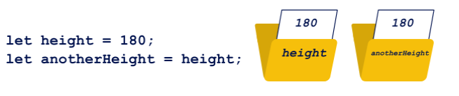

### Initializing Variables
After a successful `declaration`, the `variable` should be `initialized`, in other words, it should be given its first `value`. 

`Initialization` is done by assigning a certain `value` to a `variable` (indicated by its name). To assign it, we use the operator `=`.



You can assign to a `variable`: a specific `value`; the contents of another `variable`; or, for example, the result returned by a `function`.

`Initialization` can be done either together with the `declaration`, or separately as an independent command. It is important to enter the first `value` into the `variable` before trying to `read`, `modify`, or `display` it.

```javascript
let height = 180;
let anotherHeight = height;
let weight;

console.log(height); // -> 180
console.log(anotherHeight); // -> 180

weight = 70;
console.log(weight); // -> 70
```
The `declarations` of the `variables` `height` and `anotherHeight` are combined with their `initialization`, while the `variable` `weight` is declared and initialized separately. 
The `height` and `weight` `variables` are `initialized` by providing specific `values` (more `precisely`, a `number`), while the `anotherHeight` `variable` receives a value read from the `height` `variable`. The values of all the `variables` are displayed on the `console`.

Specifying a `variable`name in console.log, the interpreter recognizes it and displays its `valuje`.
If you put the same name/variable name in quotation marks, it will be treated as plain text, and displayed the text.

```javascript
let height = 180;
console.log(height);
console.log("height");
```